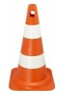
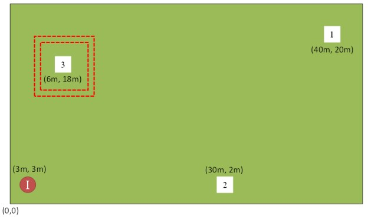
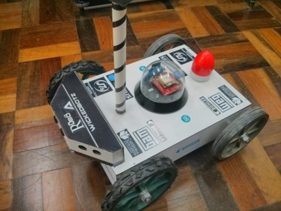

# Autonomous Trekking Robot

Project developed to participate in the Winter Challenge 10 Edition, Robocore, São Paulo, Brazil. This project was submitted to the Trekking Pro category.

## Robo Trekking Pro challenge

General rules:
* 1 robot per match
* 10 minutes to complete the test
* Max dimensions: 500x500x500mm
* The robot must be completely autonomous

The robot must be completely autonomous, terrestrial, and with all the components on board. The robot cannot be controlled externally by wire, radio, or any other communication device. The robot must have a light device to indicate the arrival at the landmarks.

During the match, the robot must depart from the origin point, and autonomously find the three landmarks.  The landmarks are identified by traffic cones, as presented in the image below.

The cones will be distributed in a grass field, positioned accordingly in the image below. The robot will depart from Point I, then move towards point 1, point 2, and point 3, in this order. The robot must touch the whiteboard and notify that the point was found emitting a light signal.

## The proposed ROBOA project

The ROBOA project was only possible due to the sponsorship of the Catholic University Center, Jaragua do Sul, SC, Brazil. The project authors were: João Pedro Schmitt, Joe Vogel, and Manfred Heil Junior, members of the WickedBotz robotic group. The image below depicts the proposed robot.

The robot was equipped with the following items:
* Arduino Mega
* GPS MG2639
* Ultrasonic Sensor HC-SR04
* Compass HMC6352
* Light
* Electric motors

The  winner robot source code is available in [this file](WinnerCode/Teste2.ino)

A video demonstrating tests made with the robot before the challenge is available at YouTube in the link below.

## Challange final classification

The proposed robot won the championship in the first position. The ranking is presented below:

* 1	WickedBotz - Robo A
* 2	KIMAUÁNISSO - Trekkinho
* 3	ThundeRatz - ThunderWaze

## References:

[NSC Total](https://www.nsctotal.com.br/noticias/alunos-do-centro-universitario-catolica-sc-de-jaragua-do-sul-e-joinville-participam-de)

[Catolica SC](http://www.catolicasc.org.br/jaragua-do-sul/2014/07/21/catoacutelica-sc-vence-competiccedilatildeo-nacional-de-roboacutetica/)

[PROINPES](http://www.catolicasc.org.br/jaragua-do-sul/wp-content/uploads/sites/3/2015/04/5385129631411388664.pdf)

[Winter Challenge 10ª Edição](https://www.robocore.net/eventos/wcx/2)